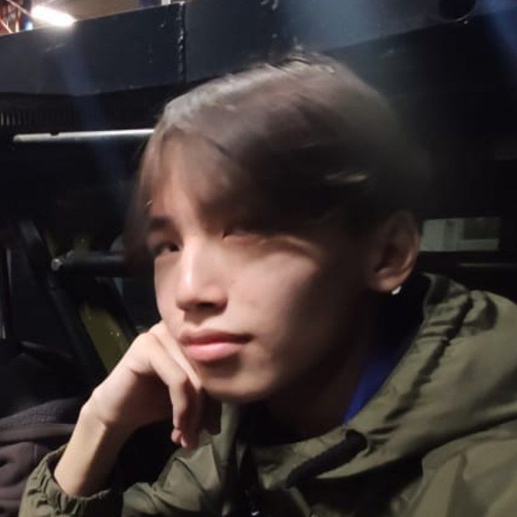
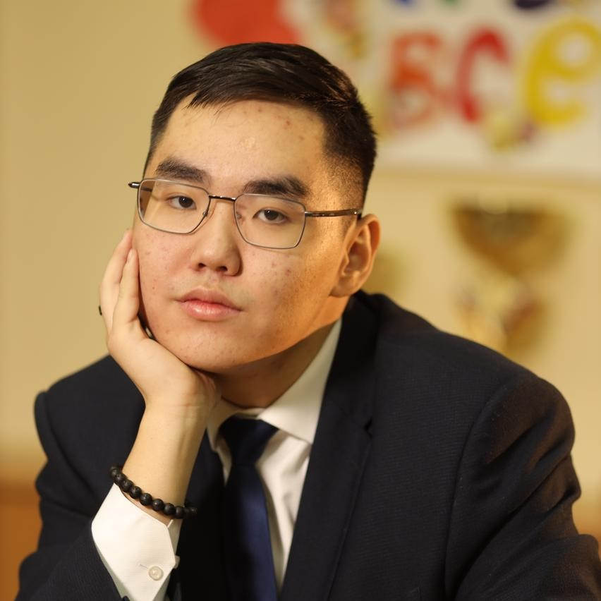

# Сообщество
Проект реализован в рамках финала конкурса "Моя Профессия - ИТ 2023".
  
Наш проект **Сообщество** решает проблему слабой проработке взаимодействий между учениками образовательных организаций.
 
Сервис предоставляет **школам** возможность **создания** различного рода мероприятий и **повышает посещаемость** мероприятий путем **геймификации** и упрощает контакт между **учениками** и **преподавательским** составом.
 
У школьника есть функционал **общения** с посетителями мероприятий, а также **создания клубов** единомышленников.
 
У родителей будут отмечаться **достижения их ребенка** по посещенным мероприятиям, возможность **записи на мероприятие**, а также **галерея результатов** учеников.

## Техническое задания
- Функционал:
- Система достижений
- Функционал социальной сети
- Удобная платформа для регистрации и организации на мероприятие
- Интерактивная карта

## Технологии back-end

- Node
- Apollo server (Graphql)
- Paljs codegen
- Express
- Docker
- Prisma ORM
- Postgresql

## Технологии front-end

- Vite + SWC
- TypeScript
- React
- Atomic Jotai state management
- Apollo client (Graphql)
- Graphql codegen
- styled-components
- ESlint, prettier, stylelint
- husky

## Команда "Аргали"
|  |  |                       Семёнова Августина |
| :------------------------------------------------------------- | :------------------------------------------------------------: | ---------------------------------------: |
| Сергин Сергей                                                  |                         Кычкин Андрей                          |                       Семёнова Августина |
| Full-Stack Web & Mobile разработчик                            |                        Product Manager                         |                           UX/UI Designer |
| Победитель и лучший   разработчик МПИТ-2021                 |                      Победитель МПИТ-2022                      |                     Победитель МПИТ-2022 |
| +7 984 109-30-55   etteryand@gmail.com                      |        +7 914 291-78-01   andrushkakychkin@gmail.com        | +7 914 277-40-56   semalvas14@mail.ru |